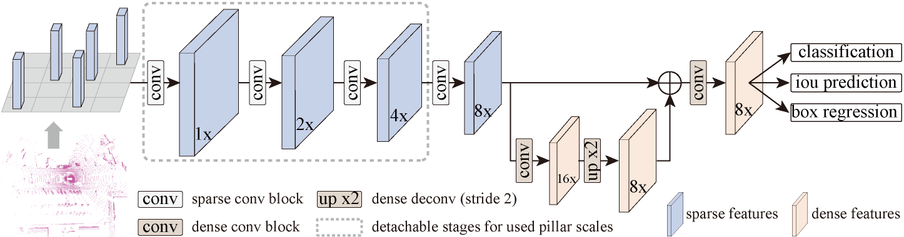
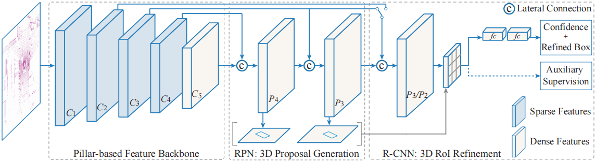

# PillarNet: Real-Time and High-Performance Pillar-based 3D Object Detection

Pillar-based single-stage 3D object detector using center-based head in the bird-eye view.

> [**PillarNet Real-Time and High-Performance Pillar-based 3D Object Detection**](https://arxiv.org/abs/2205.07403),            
> Guangsheng Shi, Ruifeng Li, Chao Ma
>
> [**Pillar R-CNN for Point Cloud 3D Object Detection**](https://arxiv.org/pdf/2302.13301),            
> Guangsheng Shi, Ruifeng Li, Chao Ma

This is the official implementation of PillarNet, a simple and high-performance pillar-based framework for 3D object detection. For more details, please refer to:

  

  

    @article{shi2022pillarnet,
      title={PillarNet: Real-Time and High-Performance Pillar-based 3D Object Detection},
      author={Guangsheng Shi, Ruifeng Li, Chao Ma},
      journal={ECCV},
      year={2022},
    }
    @article{shi2023pillar,
      title={Pillar R-CNN for Point Cloud 3D Object Detection},
      author={Shi, Guangsheng and Li, Ruifeng and Ma, Chao},
      journal={arXiv preprint arXiv:2302.13301},
      year={2023}
    }

## NEWS

**[2023-6-12]**  Introducing Pillar R-CNN into the framework. 

**[2022-7-4]**  PillarNet is accepted by **ECCV 2022**. 

**[2022-6-6]**  PillarNet achieves a good trade-off between performance and speed on nuScenes Dataset and Waymo Open Dataset. 

# TODO List

- [ ] Introducing BEVFusion for multi-modality 3D object detection.
- [ ] Towards higher performance with extra small costs.

## Contact
Any questions or suggestions are welcome! 

Guangsheng Shi [sgsadvance@163.com](mailto:sgsadvance@163.com)

There are still some engineering techniques that we believe can be used to reduce runtime while maintaining accuracy, which we will continue to update later.
We will also appreciate the readers for providing your contributions.

## Usage

You can easily re-produce the results as stated in paper.

Please install python-related packages in requirements.txt

## Acknowlegement
PillarNet is built on [CenterPoint](https://github.com/tianweiy/CenterPoint) with the same training schedule as CenterPoint-VoxelNet.
