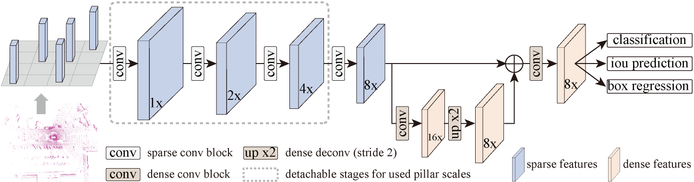

# PillarNet: Real-Time and High-Performance Pillar-based 3D Object Detection

Pillar-based single-stage 3D object detector using center-based head in the bird-eye view.

> [**PillarNet Real-Time and High-Performance Pillar-based 3D Object Detection**](https://arxiv.org/abs/2205.07403),            
> Guangsheng Shi, Ruifeng Li, Chao Ma,  


This is the official implementation of PillarNet, a simple and high-performance pillar-based framework for 3D object detection. For more details, please refer to:

<p align="center">  </p>

    @article{shi2022pillarnet,
      title={PillarNet: Real-Time and High-Performance Pillar-based 3D Object Detection},
      author={Guangsheng Shi, Ruifeng Li, Chao Ma},
      journal={arXiv},
      year={2022},
    }


## NEWS

[2022-7-4]  PillarNet is accepted by ECCV 2022. 

[2022-6-6]  PillarNet achieves a good trade-off between performance and speed for point cloud 3D object detection. 

## Contact
Any questions or suggestions are welcome! 

Guangsheng Shi [sgsadvance@163.com](mailto:sgsadvance@163.com) 
WeChat: 15158086470

There are still some engineering techniques that we believe can be used to reduce runtime while maintaining accuracy, which we will continue to update later.
The possible solutions may be the input point cloud sub-sampling or streaming pillarization as the LiDAR scanning. 
We will also appreciate the readers for providing your contributions.


## Abstract
Real-time and high-performance 3D object detection is of critical importance for autonomous driving. Recent top-performing 3D object detectors mainly rely on point-based or 3D voxel-based convolutions, which are both computationally inefficient for onboard deployment. In contrast, pillar-based methods use solely 2D convolutions, which consume less computation resources, but they lag far behind their voxel-based counterparts in detection accuracy. In this paper, by examining the primary performance gap between pillar- and voxel-based detectors, we develop a real-time and high-performance pillar-based detector, dubbed PillarNet. The proposed PillarNet consists of a powerful encoder network for effective pillar feature learning, a neck network for spatial-semantic feature fusion and the commonly used detect head. Using only 2D convolutions, PillarNet is flexible to an optional pillar size and compatible with classical 2D CNN backbones, such as VGGNet and ResNet.Additionally, PillarNet benefits from our designed orientation-decoupled IoU regression loss along with the IoU-aware prediction branch. Extensive experimental results on large-scale nuScenes Dataset and Waymo Open Dataset demonstrate that the proposed PillarNet performs well over the state-of-the-art 3D detectors in terms of effectiveness and efficiency. 


## Results

To be published.

You can check in advance from our paper [**PillarNet Real-Time and High-Performance Pillar-based 3D Object Detection**](https://arxiv.org/abs/2205.07403)


## Usage

You can easily re-produce the results as stated in paper.

Our pre-trained models uses the spconv-2.x and PyTorch ==1.8.2.

Please refer to CenterPoint for the installation and data preparation of PillarNet.

In contrast with our used codebase [CenterPoint](https://github.com/tianweiy/CenterPoint), solely small core codes can power PillarNet and also transfer to other codebase such as [mmdetection3d](https://github.com/open-mmlab/mmdetection3d) and [OpenPCDet](https://github.com/open-mmlab/OpenPCDet.git).

```
det3d/ops/pillar_ops  (lossless pillarization from raw point clouds)
det3d/models/backbones/pcnvgg.py/pcnres18.py/pcnres34.py (backbone for PillarNet)
```
**Note:**

- we also reduce the channel of conv4 from 256 (reported in paper) to 128 and find the similar performance while consuming less latency. 

  Thus, further work will be to search a better combination of conv block numbers and its feature channels in each stage using NAS.


## Acknowlegement
PillarNet is built on [CenterPoint](https://github.com/tianweiy/CenterPoint) with the same training schedule as CenterPoint-VoxelNet.
